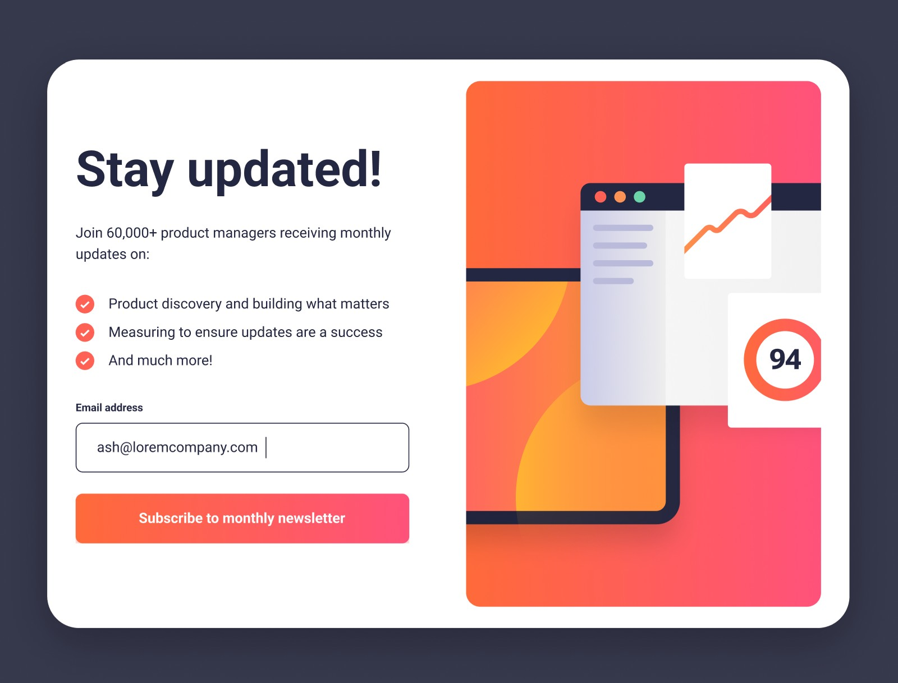

# Frontend Mentor - Newsletter sign-up form with success message solution

This is a solution to the [Newsletter sign-up form with success message challenge on Frontend Mentor](https://www.frontendmentor.io/challenges/newsletter-signup-form-with-success-message-3FC1AZbNrv). Frontend Mentor challenges help you improve your coding skills by building realistic projects.

## Table of contents

- [Overview](#overview)
  - [The challenge](#the-challenge)
  - [Screenshot](#screenshot)
  - [Links](#links)
- [My process](#my-process)
  - [Built with](#built-with)
  - [What I learned](#what-i-learned)
  - [Continued development](#continued-development)
  - [Useful resources](#useful-resources)
  - [AI Collaboration](#ai-collaboration)
- [Author](#author)

## Overview

### The challenge

Users are able to:

- Add their email and submit the form
- See a success message with their email after successfully submitting the form
- See form validation messages if:
  - The field is left empty
  - The email address is not formatted correctly
- View the optimal layout for the interface depending on their device's screen size (mobile shows a full-screen success page, tablet/desktop shows a centered success modal)
- See hover and focus states for all interactive elements on the page

### Screenshot

### Links

- Solution URL: [Repository](https://github.com/jonghwascript/newsletter-sign-up-with-success-message.git)
- Live Site URL: [Live site](https://jonghwascript.github.io/newsletter-sign-up-with-success-message
)

## My process

### Built with

- Semantic HTML5 markup
- SCSS (Dart Sass) with the module system (`@use`/`@forward`), partials for
  variables/mixins/fonts, and a `map.get`/`map.has-key`-based `mq()` mixin for
  breakpoints
- CSS custom properties (used to expose the current breakpoint to JavaScript)
- Flexbox
- Mobile-first workflow
- [jQuery](https://jquery.com/) - form submission handling and custom
  validation UI
- [Gulp](https://gulpjs.com/) - build pipeline (Sass compilation,
  sourcemaps, Prettier formatting)

### What I learned

This project was as much about debugging real responsive/accessibility bugs
as it was about building the UI. The full write-ups (with code snippets)
live in the [`lessons/`](./lessons) folder; the highlights:

- **`<picture>` `<source>` order matters.** The browser evaluates `<source>`
  elements in document order and picks the *first* one whose `media` query
  matches — not the most specific one. Listing a `min-width: 768px` source
  before a `min-width: 1200px` source meant the desktop image was never
  selected. See [`lessons/css.md`](./lessons/css.md).
- **`max-width: 100%` alone doesn't fill a container.** An `` without
  an explicit `width` renders at its intrinsic size; `max-inline-size: 100%`
  only caps growth. Adding `inline-size: 100%` alongside it was needed to
  make the illustration actually fill its container on tablet.
- **CSS custom properties only inherit downward.** I experimented with
  exposing the current breakpoint to JS via a `--device-state` custom
  property, declaring it on `body` and overriding it on `main` — reading
  the value from `document.body` in JS always returned the initial value,
  since an override never reaches an ancestor. This experiment was later
  removed from the codebase in favor of the form logic below, but the
  pattern and pitfall are written up in
  [`lessons/js.md`](./lessons/js.md) and [`lessons/css.md`](./lessons/css.md).
- **Use the form's `submit` event, not the button's `click` event**, to
  gate logic on native HTML validation passing — the browser only fires
  `submit` after all required fields validate.
- **An undefined CSS custom property fails silently.** `outline: 2px solid
  var(--Grey-500)` referenced a variable that didn't exist anywhere in the
  codebase, which made the whole `outline` declaration invalid — combined
  with a global `outline: none` reset, this silently removed the keyboard
  focus indicator for every button. See
  [`lessons/accessibility.md`](./lessons/accessibility.md).
- **A `<label>` next to an `<input>` isn't automatically associated with
  it.** Screen readers need `for`/`id` (or wrapping) to announce a label;
  visual adjacency isn't enough.
- **Mutually-exclusive responsive layouts need symmetric breakpoints.**
  Showing a popup modal from tablet width up with `display: block` isn't
  enough on its own — the mobile full-screen version needs the matching
  `display: none` at the same breakpoint, or both render at once.
- **`url()` paths in Sass resolve relative to the compiled CSS, not the
  `.scss` source file.** `_fonts.scss` and `style.scss` live two levels
  deep (`src/scss/`) and used `../../fonts` / `../../images`, which was
  correct for their own location but not for `css/style.css` — one level
  shallower. That extra `../` pointed outside the project entirely, so
  the Roboto fonts and the benefits-list bullet icon silently failed once
  actually deployed (locally the fallback font is close enough that it
  went unnoticed).
- **A `format()` hint has to match the real file type.** The `@font-face`
  rules declared `format('woff2')` for files that are actually `.ttf`.
  Browsers use that hint to decide whether to even attempt the download,
  so a mismatched hint can make a font silently fail to load — it needs
  to say `format('truetype')` unless the files are actually converted to
  WOFF2.
- **Carry real data across a full-page navigation via the URL.** The
  success page originally hard-coded `ash@loremcompany.com` for every
  visitor. Passing the submitted address as a query string
  (`success.html?email=...`) and reading it back with `URLSearchParams`
  on load was enough to show the address the user actually typed, without
  needing `sessionStorage` or a backend.
- **A custom validation message needs to be wired to the input, not just
  styled to look connected.** A `` next to an `<input>` that only
  toggles a CSS class is invisible to assistive tech. The message needed
  an `id` referenced by the input's `aria-describedby`, plus a live
  `aria-invalid` attribute toggled alongside the visual `.invalid` class,
  so a screen reader actually announces the custom text instead of (or
  in addition to) the browser's generic one.
- **A modal needs `<dialog>` + `showModal()`, not just a `div` styled to
  look like one.** The success overlay was a plain `
` shown via a
  CSS breakpoint — no accessible name, no focus trapping, no focus
  returned anywhere on close. Switching it to a real `<dialog>` with
  `aria-labelledby`, calling `.showModal()`/`.close()` from a
  `matchMedia` listener tied to the same breakpoint, and handling the
  native `cancel` event (Escape key) gets real dialog semantics and
  keyboard-trap behavior for free from the browser.

### Continued development

- Add automated linting (`stylelint`, `eslint`, `html-validate`) as real
  `devDependencies` and wire them into the Gulp pipeline instead of running
  them ad hoc.
- Replace the jQuery-based form/validation script with vanilla JavaScript.
- Add a proper accessible live region announcement when the invalid-email
  message appears/disappears.

### Useful resources

- [MDN: Using the picture element](https://developer.mozilla.org/en-US/docs/Web/HTML/Element/picture) - clarified that `<source>` order (not specificity) decides which image loads.
- [MDN: CSS custom properties (`--*`), Inheritance](https://developer.mozilla.org/en-US/docs/Web/CSS/--*) - explained why a custom property set on a descendant never affects an ancestor's computed value.
- [web.dev: Accessible forms](https://web.dev/learn/forms/form-field) - reference for correctly associating `<label>` and `<input>`.

### AI Collaboration

I used [Claude Code](https://claude.com/claude-code) as a pair-programming
and code-review partner throughout this project.

- **What I used it for**: diagnosing Sass compilation errors (undefined
  variables, deprecated global functions), debugging the `<picture>` source
  order and image-sizing issues, explaining *why* a CSS custom property
  wasn't reaching the element I expected, wiring up the jQuery form
  validation logic, and running a structured review pass across
  accessibility (axe rule categories), HTML (`html-validate`), CSS
  (`stylelint`), and JavaScript (`eslint`).
- **What worked well**: asking it to explain the *root cause* of a bug
  (not just hand me a fix) meant I could apply the same reasoning
  elsewhere — e.g. once I understood custom-property inheritance direction,
  I could tell on my own that the focus-outline bug was the same class of
  problem.
- **What I'd do differently**: run the linting pass earlier in the project
  instead of at the end, since several of the issues it caught (missing
  label association, the undefined `--Grey-500` outline color) were cheap
  to avoid from the start.

## Author

- Frontend Mentor - [@jonghwascript](https://www.frontendmentor.io/profile/jonghwascript)
